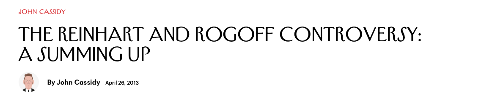

```{r setup, include=FALSE}
library(knitr)
knitr::opts_chunk$set(echo = TRUE)
```

# What is reproducible research?

## Reproducible versus Replicable?

- Replication: does an independent experiment produce results consistant with another?

- Reproduction: can the same result be achieved with the same data and methods?

## Why creating reproducible work is important

<div align="center">

</div>

## Why creating reproducible work is important

<div align="center">

</div>

- www.newyorker.com/news/john-cassidy/the-reinhart-and-rogoff-controversy-a-summing-up

## Why creating reproducible work is important

<div align="center">

</div>

- www.economist.com/node/21528593

## Why creating reproducible work is important

<div align="center">

</div>

# Towards making your research reproducible

## What makes research reproducible

- Data availibilty

- Code available (e.g. methods, data simulation, tables, ...)

- Documentation to assemble data and code to produce the results

## Some immediate advantages for you

- Easily pick up where you left off even months after you left off

- Easily make adjustments and re-run your analysis

- Full documentation from data collection to publication

- Easily share your work

## Some important practical steps

- Link your analysis to the raw data and document how it was collected
- The original data should remain unmodified
- Avoid any "by hand" steps in your analysis
- Include scripts that take the raw data through to the final results / figure / tables you publish
- Include software versions

# Coding style

## Why is style important

- Style guidelines provide rules for how to format code in a script

- Following style guidelines offers some important advantages:
    + Clean code is easier to read and interpret later.
    + It’s easier to catch and fix mistakes when code is clear.
    + Others can more easily follow and adapt your code if it’s clean.
    + Some style guidelines will help prevent possible problems (e.g.,
avoiding . in function names).

## R style guidelines

Two potential sources:

- [Google's R style guidelines](https://google.github.io/styleguide/Rguide.xml)
- [Hadley Wickham's R style guidelines](http://adv-r.had.co.nz/Style.html)

## R style guidelines overview

- Naming objects:
    + Lowercase letters and numbers
    + How to separate words?

- Meaningful names:
    + Descriptive names for scripts ("random_group_assignment.R")
    + Nouns for objects (`group_exposures`)
    + Verbs for functions (`power_transform_exposures`)

## Line length

Google: **Keep lines to 80 characters or less** \medskip

To set your script pane to be limited to 80 characters, go to "RStudio" -> "Preferences" -> "Code" -> "Display", and set "Margin Column" to 80.

```{r eval = FALSE, echo = TRUE}
# Do
my_df <- data.frame(n = 1:3,
                    letter = c("a", "b", "c"),
                    cap_letter = c("A", "B", "C"))

# Don't
my_df <- data.frame(n = 1:3, letter = c("a", "b", "c"), cap_letter = c("A", "B", "C"))
```

This guideline helps ensure that your code is formatted in a way that you can see all of the code without scrolling horizontally (left and right).

## Spacing

- Operators (e.g., `<-`, `+`, `-`, `=`) should have a space on either side.
- A comma should have a space after.
- Colons should not have a space on either side.

```{r eval = FALSE, echo = TRUE}
# Do
shots_per_min <- worldcup$Shots / worldcup$Time
#Don't 
shots_per_min<-worldcup$Shots/worldcup$Time

#Do
ave_time <- mean(worldcup[1:10, "Time"])
#Don't
ave_time<-mean(worldcup[1 : 10 ,"Time"])
```

## Semicolons

Although you can use a semicolon to put two lines of code on the same line, you should avoid it. 

```{r eval = FALSE, echo = TRUE}
# Do
a <- 1:10
b <- 3

# Don't
a <- 1:10; b <- 3
```

## Commenting

- For a comment on its own line, use `#`. Follow with a space, then the comment. 
- You can put a short comment at the end of a line of R code. In this case, put two spaces after the end of the code, one `#`, and one more space before the comment.
- If it helps make it easier to read your code, separate sections using a comment character followed by many hyphens (e.g., `#------------`). Anything after the comment character is "muted". 

```{r eval = FALSE, echo = TRUE}
# Read in exposure data ---------------------------

# Organize exposure data --------------------------
```

## Indentation

Google:

- Within function calls, line up new lines with first letter after opening parenthesis for parameters to function calls:

Example:

```{r eval = FALSE, echo = TRUE}
# Relabel sex variable
nepali$sex <- factor(nepali$sex, 
                     levels = c(1, 2),
                     labels = c("Male", "Female"))
```

## Code grouping

- Group related pieces of code together. 
- Separate blocks of code by empty spaces.

```{r eval = TRUE}
# Load data
library(faraway)
data(nepali)

# Relabel sex variable
nepali$sex <- factor(nepali$sex, 
                     levels = c(1, 2),
                     labels = c("Male", "Female"))
```

Note that this grouping often happens naturally when using tidyverse functions, since they encourage piping (`%>%` and `+`).

## Broader guidelines

- Omit needless code.
- Don't repeat yourself.

We'll learn more about satisfying these guidelines when we talk about writing your own functions in the next part of the class

# Code and data sharing

## Choosing your sharing platform
<br>
<div align="center">

</div>
<br>
<div align="center">

</div>
<div align="center">

</div>

# Markup

## What is a markup language?

- In markup languages, you markup the document directly to show what formatting the final version should have (e.g., you type `**bold**` in the file to end up with a document with **bold**).

- Examples include: HTML, LaTex, and Markdown

## For example

<br>
<div align="center">

</div>
<br>

## For example

<br>
<div align="center">

</div>
<br>

# R tools for reproducible research

## Literate programming with `knitr`

The `knitr` package can be used for literate programming in R. \bigskip

```{r echo = FALSE, out.width = "\\textwidth"}
knitr::include_graphics("images/markdown_workflow.png")
```

(Source: RMarkdown Cheatsheet, RStudio) \bigskip

In essence, `knitr` allows you to write an R Markdown file that can be rendered into a pdf, Word, or HTML document.

## Basics

- To open a new RMarkdown file, go to "File" -> "New File" -> "RMarkdown..." -> for now, chose a "Document" in "HTML" format.
- This will open a new R Markdown file in RStudio. The file extension for RMarkdown files is ".Rmd". 
- The new file comes with some example code and text. You can run the file as-is to try out the example. You will ultimately delete this example code and text and replace it with your own.
- Once you "knit" the R Markdown file, R will render an HTML file with the output. This is automatically saved in the same directory where you saved your .Rmd file.
- Write everything besides R code using Markdown syntax.

## Chunk syntax

To include R code in an RMarkdown document, separate off the code chunk using the following syntax:

    `r ''````{r}
    my_vec <- 1:10
    ```

## Naming chunks

You can specify a name for each chunk, if you'd like, by including it after "r" when you begin your chunk. \medskip

For example, to give the name `load_nepali` to a code chunk that loads the `nepali` dataset, specify that name in the start of the code chunk: \bigskip

    `r ''````{r load_nepali}
    library(faraway)
    data(nepali)
    ```

\bigskip 

Some tips: 

- Chunk names must be unique across a document.
- Any chunks you don't name are given numbers by `knitr`.

## Naming chunks

You do not have to name each chunk. However, there are some advantages: 

- It will be easier to find any errors.  
- You can use the chunk labels in referencing for figure labels. 
- You can reference chunks later by name.

## Chunk options

You can add options when you start a chunk. Many of these options can be set as TRUE / FALSE and include:

```{r echo = FALSE}
chunk_opts <- data.frame(Option = c("`echo`",
                                    "`eval`",
                                    "`messages`",
                                    "`warnings`",
                                    "`include`"),
                         Action = c("Print out the R code?",
                                    "Run the R code?",
                                    "Print out messages?",
                                    "Print out warnings?",
                                    "If FALSE, run code, but don't print code or results"))
knitr::kable(chunk_opts)
```

## Chunk options

Other chunk options take values other than TRUE / FALSE. Some you might want to include are:

```{r echo = FALSE}
chunk_opts2 <- data.frame(Option = c("`results`",
                                     "`fig.width`",
                                     "`fig.height`"),
                          Action = c("How to print results (e.g., `hide` runs the code, but doesn't print the results)",
                                     "Width to print your figure, in inches (e.g., `fig.width = 4`)",
                                     "Height to print your figure"))
pander::pander(chunk_opts2, split.cells = c(10, 50),
               justify = c("center", "left"))
```

## Chunk options

Add these options in the opening brackets and separate multiple ones with commas:

```{r  messages = FALSE, echo = FALSE}
    nepali[1, 1:3]
```

\bigskip 

We will go over other options later, once you've gotten the chance to try writting R Markdown files.

## Global options

You can set "global" options at the beginning of the document. This will create new defaults for all of the chunks in the document. \bigskip

For example, if you want `echo`, `warning`, and `message` to be `FALSE` by default in all code chunks, you can run: \bigskip


## Global options

Options that you set specifically for a chunk will take precedence over global options. \bigskip

For example, running a document with:

```{r  check_nepali, echo = TRUE}
    head(nepali, 1)
```

would print the code for the `check_nepali` chunk.

## Inline code

You can also include R output directly in your text ("inline") using backticks: \bigskip

There are `` `r '\x60r nrow(nepali)\x60'` `` observations in the `nepali` data set. The average age is `` `r '\x60r mean(nepali$age, na.rm = TRUE)\x60'` `` months.

\bigskip

Once the file is rendered, this gives: \bigskip

There are `r nrow(nepali)` observations in the `nepali` data set. The average age is `r mean(nepali$age, na.rm = TRUE)` months.

# Working with Rmd files

## R Markdown tips

Here are two tips that will help you diagnose some problems rendering R Markdown files:

- Be sure to save your R Markdown file before you run it.
- All the code in the file will run "from scratch"-- as if you just opened a new R session.
- The code will run using, as a working directory, the directory where you saved the R Markdown file.

## Running code

You'll want to try out pieces of your code as you write an R Markdown document. There are a few ways you can do that:

- You can run code in chunks just like you can run code from a script (Ctrl-Return or the "Run" button). 
- You can run all the code in a chunk (or all the code in all chunks) using the different options under the "Run" button in RStudio. 
- All the "Run" options have keyboard shortcuts, so you can use those.

## Compiling to other formats

You can compile R Markdown documents to other formats:

- Word
- Pdf (requires that you've installed "Tex" on your computer.)
- Slides (ioslides)

\bigskip

Click the button to the right of "Knit" to see different options for rendering on your computer. 

## RPubs

You can freely post your RMarkdown documents at [RPubs](http://rpubs.com). \bigskip

If you want to post to RPubs, you need to create an account. Once you do, you can click the "Publish" button on the window that pops up with your compiled file. \bigskip

RPubs can also be a great place to look for interesting example code.

## Find out more

Here are two good how-to books on reproducible research in R (our library has both):

- *Reproducible Research with R and RStudio*, Christopher Gandrud
- *Dynamic Documents with R and knitr*, Yihui Xie

## R Notebooks

From RStudio's [article on R Notebooks](http://rmarkdown.rstudio.com/r_notebooks.html):

> "An R Notebook is an R Markdown document with chunks that can be executed independently and interactively, with output visible immediately beneath the input."

R Notebooks are a new feature. Right now, if you want to use them, you need to update to RStudio's Preview version. You can get that [here](https://www.rstudio.com/products/rstudio/download/preview/).

## R Notebooks

You can render an R Notebook document to a final, static version (e.g., pdf, Word, HTML) just like an R Markdown file.  

Therefore, you can use R Notebooks as an alternative to R Markdown, with the ability to try out and change chunks interactively as you write the document.

## Templates

R Markdown **templates** can be used to change multiple elements of the style of a rendered document. You can think of these as being the document-level analog to the themes we've used with `ggplot` objects.  

To do this, some kind of style file is applied when rendering document. For HTML documents, Cascading Style Sheets (CSS) (`.css`) can be used to change the style of different elements. For pdf files, LaTeX package (style) files (`.sty`) are used. 

To open a new R Markdown file that uses a template, in RStudio, go to "File" -> "New File" -> "R Markdown" -> "From Template".

## Templates

Different templates come with different R packages. A couple of templates come with the `rmarkdown` package, which you likely already have. 

Many of these templates will only render to pdf.

To render a pdf from R Markdown, you need to have a version of TeX installed on your computer. Like R, TeX is open source software. RStudio recommends the following installations by system:

- For Macs: MacTeX
- For PCs: MiKTeX

## Templates

Links for installing both can be found at http://www.latex-project.org/ftp.html  

Current version of TeX: 3.14159265.

## Templates

The `tufte` package has templates for creating handouts typeset like Edward Tufte's books.

This package includes templates for creating both pdf and HTML documents in this style.

The package includes special functions like `newthought`, special chunk options like `fig.fullwidth`, and special knitr engines like `marginfigure`. Special features available in the tufte template include:

- Margin references
- Margin figures
- Side notes
- Full width figures

## Templates

The `rticles` package has templates for several journals: 

- *Journal of Statistical Software* 
- *The R Journal*
- *Association for Computing Machinery*
- ACS publications (*Journal of the American Chemical Society*, *Environmental Science & Technology*) 
- Elsevier publications

## Templates

Some of these templates create a whole directory, with several files besides the .Rmd file. For example, the template for *The R Journal* includes: 

- The R Markdown file in which you write your article
- "RJournal.sty": A LaTeX package (style) file specific to *The R Journal*. This file tells LaTeX how to render all the elements in your article in the style desired by this journal. 
- "RJreferences.bib": A BibTeX file, where you can save citation information for all references in your article.
- "Rlogo.png": An example figure (the R logo).

## Templates

As a note, you can always use raw LaTeX in R Markdown documents, not just in documents you're creating with a template. You just need to be careful not to mix the two. For example, if you use a LaTeX environment to begin an itemized list (e.g., with `begin{itemize}`), you must start each item with `item`, not `-`. 

You can create your own template. You create it as part of a custom R package, and then will have access to the template once you've installed the package. This can be useful if you often write documents in a certain style, or if you ever work somewhere with certain formatting requirements for reports.  

RStudio has full instructions for creating your own template: http://rmarkdown.rstudio.com/developer_document_templates.html

# R Projects

## Organization

As you move to larger projects, you'll want to start keeping all materials for a project in a single and exclusive directory.

Often, it helps to organize the files in a project directory into subdirectories. Common subdirectories might include: 

- `data_raw`: Raw data and R scripts to clean the raw data. 
- `data`: Cleaned data, often saved as `.RData` after being generated by a script in `data-raw`.
- `r_code`: Code for any functions used in analysis.
- `reports`: Any final products rendered from R Markdown and their original R Markdown files (e.g., paper drafts, reports, presentations).

## Creating R Projects

RStudio allows you to create "Projects" to organize code, data, and results within a directory. When you create a project, RStudio adds a file with the extension ".Rproj" to the directory.  

There are some advantages to setting a directory to be an R Project. The project:

- Automatically uses the directory as your current working directory when you open the project.
- Coordinates well with git version control and GitHub repository system.
- Opens a "Files" window for navigating project files in an RStudio pane when you open the project.

## Creating R Projects

You can create a new project from scratch or from an existing directory.

To create an R project from a working directory, in RStudio go to "File" -> "New Project" -> "New Directory". You can then choose where you want to save the new project directory.

# git

## Version control

Git is a version control system.

It saves information about all changes you make on all files in a repository. This allows you to revert back to previous versions and search through the history for all files in the repository.

## Installing git

Git is open source. You can download it for different operating systems here:

https://git-scm.com/downloads

- You will need git on your computer to use git with RStudio and create local git repositories you can sync with GitHub repositories.

- Before you use git, you should configure it.

## Initializing a git repository

You can initialize a git repository for a directory that is an R Project directory through R Studio. 

1. Open the Project. 
2. Go to "Tools" -> "Version Control" -> "Project Setup".
3. In the box for "Version control system", choose "Git".

**Note:** If you have just installed git, and have not restarted RStudio, you'll need to do that before RStudio will recognize git. If you do not see "Git" in the box for "Version control system", it means either that you do not have git installed on your computer or that RStudio was unable to find it.

## Initializing a git repository

Once you initialize the project as a git repository, you should have a "Git" window in one of your RStudio panes (top right pane by default). 

As you make and save changes to files, they will show up in this window for you to commit.

```{r echo = FALSE, out.width = "\\textwidth", fig.align="center"}
knitr::include_graphics("images/example_git_window.png")
```

## Committing

When you want git to record changes, you *commit* the files with the changes. Each time you commit, you have to include a short commit message with some information about the changes. 

<div align="center">

</div>

## Github 

GitHub allows you to host git repositories online. This allows you to: 

- Work collaboratively on a shared repository
- Fork someone else's repository to create your own copy that you can use and change as you want
- Suggest changes to other people's repositories through pull requests

To push local repositories to GitHub and fork other people's repositories, you will need a GitHub account.

# Example - cookstove research

# Example - this talk