```{r setup, include=FALSE}
library(knitr)
knitr::opts_chunk$set(echo = TRUE)
library(faraway)
data(nepali)
```

# What is reproducible research?

## Reproducible versus Replicable?

- Replication: does an independent experiment produce results consistent with another?

- Reproduction: can the same result be achieved with the same data and methods?

## Why creating reproducible work is important

<div align="center">
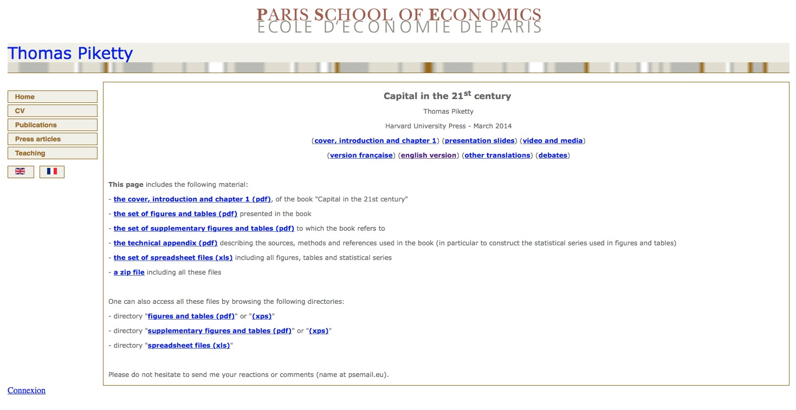
</div>

## Why creating reproducible work is important

<div align="center">
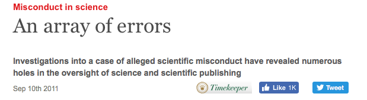
</div>

- [Array of errors](http://www.economist.com/node/21528593)

## Why creating reproducible work is important

<div align="center">

</div>

# Towards making your research reproducible

## What makes research reproducible

- Data availability.

- Code available (e.g. methods, data simulation, tables).

- Documentation to assemble data and code to produce the results.

## Some immediate advantages for you

- Easily pick up where you left off (e.g. journal reviews months after submission).

- Easily make adjustments and re-run your analysis.

- Full documentation from data collection to publication.

- Others can use your methods (increase opportunities for collaboration, citations).

## Some important practical steps

- Link your analysis to the raw data and document how it was collected.
- The original data should remain unmodified.
- Avoid any "by hand" steps in your analysis.
- Include scripts that take the raw data through to the final results / figure / tables you publish.
- Include software versions.

# Coding style

## Why is style important

- Style guidelines provide rules for how to format code in a script.

- Following style guidelines offers some important advantages:
    + Clean code is easier to read and interpret.
    + Easier to catch and fix mistakes.
    + Others can more easily follow and adapt your code.
    + Help prevent problems (e.g., avoiding . in function names).

## R style guidelines

Two potential sources:

- [Google's R style guidelines](https://google.github.io/styleguide/Rguide.xml)
- [Hadley Wickham's R style guidelines](http://adv-r.had.co.nz/Style.html)

## R style considerations

- Naming objects
- Line length
- Spacing
- Commenting
- Indentation
- Code grouping

# Code and data sharing

## Choosing your sharing platform

<br>
<div align="center">

</div>
<br>
<div align="center">

</div>
<div align="center">

</div>

# Markup

## What is a markup language?

- In markup languages, you markup the document directly to show what formatting the final version should have (e.g., you type `**bold**` in the file to end up with a document with **bold**).

- Examples include: HTML, LaTex, and Markdown

## For example

<br>
<div align="center">
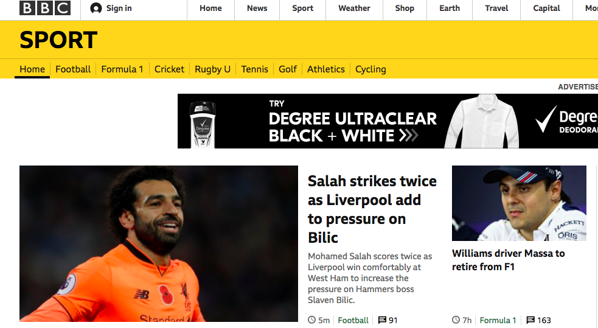
</div>
<br>

## For example

<br>
<div align="center">

</div>
<br>

# R tools for reproducible research

## Literate programming with `knitr`

The `knitr` package can be used for literate programming in R. \bigskip

```{r echo = FALSE, out.width = "\\textwidth"}
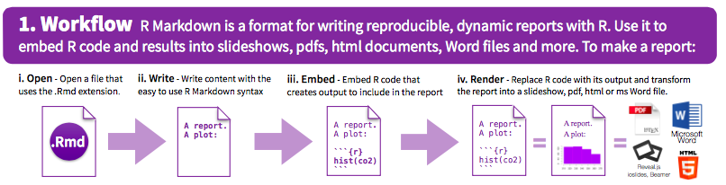
```

(Source: RMarkdown Cheatsheet, RStudio) \bigskip

You can write an R Markdown file that can be rendered into a pdf, Word, or HTML document.

## Tips and notes: Naming chunks

- Chunk names must be unique across a document.
- Any chunks you don't name are given numbers by `knitr`.
- It will be easier to find any errors.  
- You can use the chunk labels in referencing for figure labels. 
- You can reference chunks later by name.

## Tips and notes: Global options

You can set "global" options at the beginning of the document. This will create new defaults for all of the chunks in the document. For example, if you want `echo`, `warning`, and `message` to be `FALSE` by default in all code chunks, you can run: 

    `r ''````{r  global_options}
    knitr::opts_chunk$set(echo = FALSE,
                          message = FALSE,
                          warning = FALSE)
    ```

Local chunk options will take precedence over global options.

## Tips and notes: 

- The code will run using, as a working directory, the directory where you saved the R Markdown file.

- There are a few ways to run code segments (run options have keyboard shortcuts)

## Compiling to other formats

You can compile R Markdown documents to other formats:

- Word.
- Pdf (requires that you've installed "Tex" on your computer, an essential tool for thesis production).

\bigskip

Click the button to the right of "Knit" to see different options for rendering on your computer. 

## RPubs

You can freely post your RMarkdown documents at http://rpubs.com. \bigskip

If you want to post to RPubs, you need to create an account. Once you do, you can click the "Publish" button on the window that pops up with your compiled file. \bigskip

RPubs can also be a great place to look for interesting example code.

## Find out more

Here are two good how-to books on reproducible research in R (our library has both):

- *Reproducible Research with R and RStudio*, Christopher Gandrud
- *Dynamic Documents with R and knitr*, Yihui Xie

## Templates

R Markdown **templates** can be used to style a document (i.e. a theme).

A style file is applied when rendering document (e.g. Cascading Style Sheets [CSS] for html).

To open a new R Markdown file that uses a template, in RStudio, go to "File" -> "New File" -> "R Markdown" -> "From Template".

## Templates

Different templates come with different R packages (including the `rmarkdown` package).

Many of these templates will only render to pdf (and requires TeX e.g. MacTeX or MiTex).

Links for installing both can be found at: http://www.latex-project.org/ftp.html  

## Templates

The `rticles` package has templates for several journals:

- *Journal of Statistical Software*
- *The R Journal*
- *Association for Computing Machinery*
- ACS publications (*Journal of the American Chemical Society*, *Environmental Science & Technology*)
- Elsevier publications

# R Projects

## Organization

As you move to larger projects, you'll want to start keeping all materials for a project in a single directory. Sub directories might include: 

- `data_raw`: Raw data.
- `data`: Cleaned data, often saved as `.RData`.
- `r_code`: Code for any functions used in analysis.
- `reports`: Final products (e.g., paper drafts, reports, presentations).

## Creating R Projects

When you create an RStudio project, a file with the extension ".Rproj" is added to the directory.

Advantages of RStudio projects:

- Automatically uses the directory as your current working directory when you open the project.
- Coordinates well with git version control and GitHub repository system.
- Opens a "Files" window for navigating project files in an RStudio pane when you open the project.

## Creating R Projects

You can create a new project from scratch or from an existing directory.

To create an R project from a working directory, in RStudio go to "File" -> "New Project" -> "New Directory". You can then choose where you want to save the new project directory.

<div align="center">
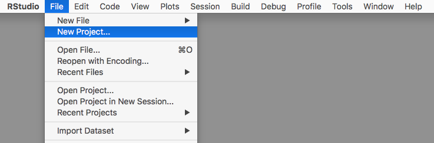
</div>

# git

## Version control

Git is a version control system.

It saves information about all changes you make on all files in a repository. This allows you to revert back to previous versions and search through the history for all files in the repository.

## Installing git

Git is open source. You can download it for different operating systems here:

https://git-scm.com/downloads

- You will need git on your computer to use git with RStudio and create local git repositories you can sync with GitHub repositories.

- Before you use git, you will need to configure it.

## Initializing a git repository

You can initialize a git repository for a directory that is an R Project directory through R Studio. 

1. Open the Project. 
2. Go to "Tools" -> "Version Control" -> "Project Setup".
3. In the box for "Version control system", choose "Git".

**Note:** If you have just installed git you will need to restart RStudio.

## Initializing a git repository

Once you initialize the project as a git repository, you should have a "Git" window in one of your RStudio panes (top right pane by default). 

As you make and save changes to files, they will show up in this window for you to commit.

```{r echo = FALSE, out.width = "\\textwidth", fig.align="center"}
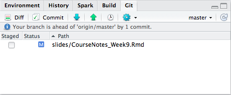
```

## Committing

When you want git to record changes, you *commit* the files with the changes. Each time you commit, you have to include a short commit message with some information about the changes. 

<div align="center">
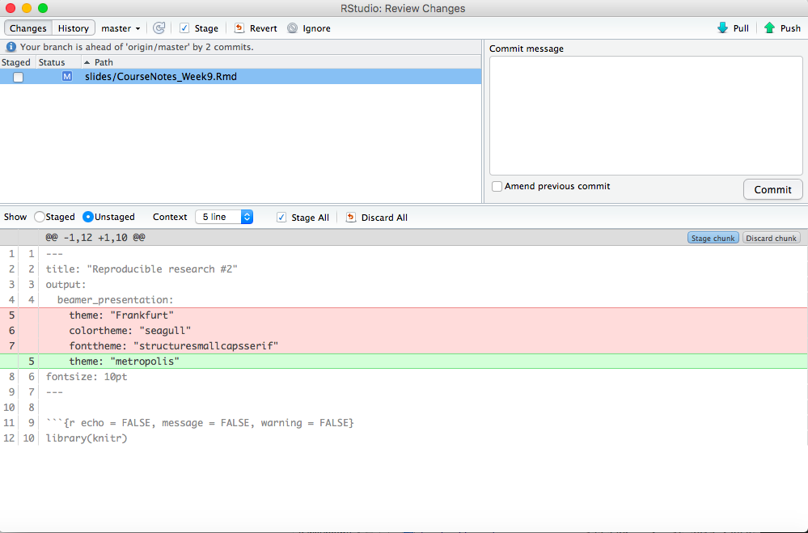
</div>

## Github 

GitHub allows you to host git repositories online. This allows you to: 

- Work collaboratively on a shared repository.
- Fork someone else's repository to create your own copy that you can use and change as you want.
- Suggest changes to other people's repositories through pull requests.

To push local repositories to GitHub and fork other people's repositories, you will need a GitHub account.

## R packages on Github

- Many R packages are available on GitHub.

- Use the `devtools` package to install them.

```{r echo = TRUE, eval = FALSE} 
  install.packages("devtools")

  devtools::install_github("hadley/dplyr")
```

# Example - cookstove research

## Cookstove research

<div align="center">
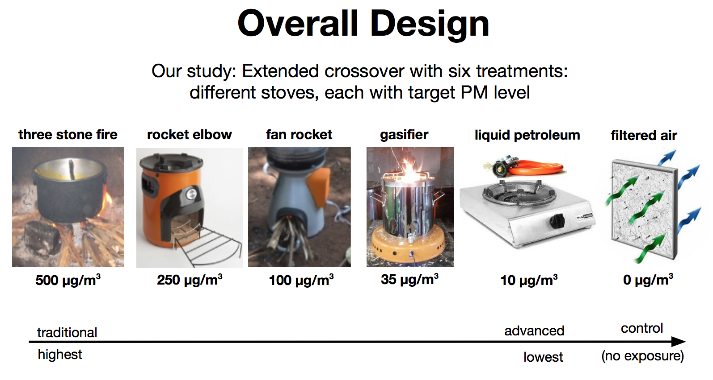
</div>

## Cookstove research

<div align="center">
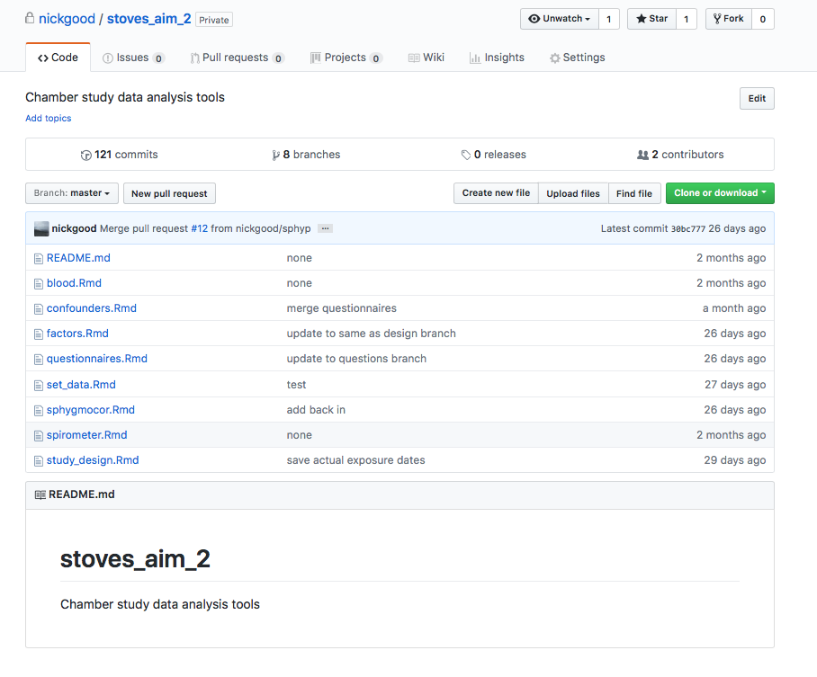
</div>

## Cookstove research

<div align="center">
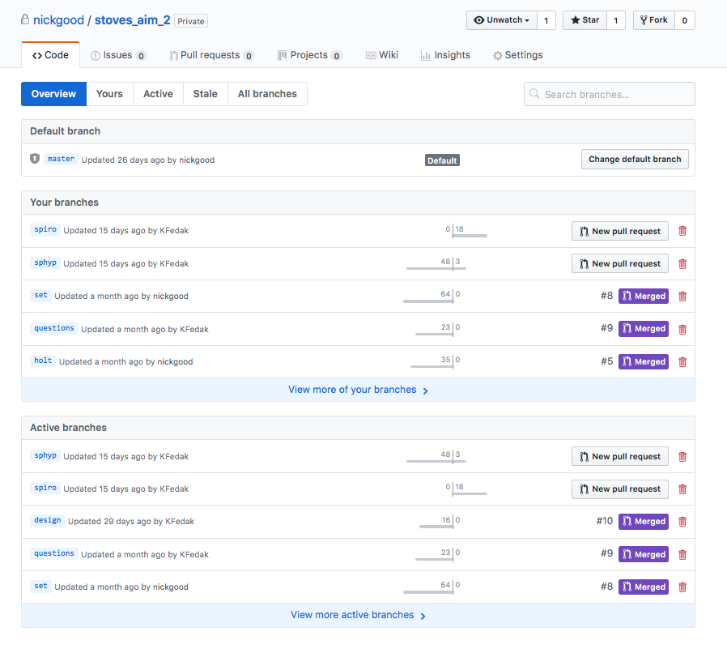
</div>

# Example - this class

## [Github page](https://github.com/nickgood/r_for_reproducible_research)

<div align="center">
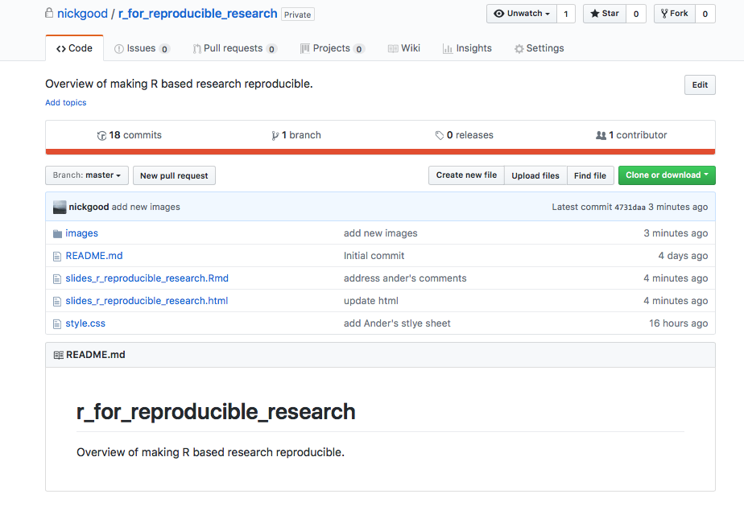
</div>

