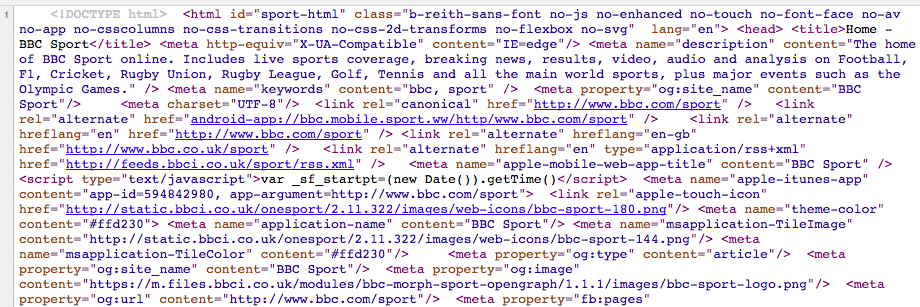

```{r setup, include=FALSE}
library(knitr)
knitr::opts_chunk$set(echo = TRUE)
```

# What is reproducible research?

## Reproducible versus Replicable?

- Replication: does an independent experiment produce results consistant with another?

- Reproduction: can the same result be achieved with the same data and methods?

## Why creating reproducible work is important

<div align="center">

</div>

## Why creating reproducible work is important

<div align="center">

</div>

- www.newyorker.com/news/john-cassidy/the-reinhart-and-rogoff-controversy-a-summing-up

## Why creating reproducible work is important

<div align="center">

</div>

- www.economist.com/node/21528593

## Why creating reproducible work is important

<div align="center">

</div>

# Towards making your research reproducible

## What makes research reproducible

- data availibilty

- code/software available

- documentation to assemble data and code to produce the results

## Some immediate advantages for you

- Easily pick up where you left off even months after you left off

- Easily make adjustments and re-run your analysis

- Full documentation from data collection to publication

- Easily share your work

## Some important practical steps

- Link your analysis to the raw data and document how it was collected
- The original data should remain unmodified
- Avoid any "by hand" steps in your analysis
- Include scripts that take the raw data through to the final results / figure / tables you publish
- Include software versions

# Coding style

## Why is style important

- Style guidelines provide rules for how to format code in a script

- Following style guidelines offers some important advantages:
    + Clean code is easier to read and interpret later.
    + It’s easier to catch and fix mistakes when code is clear.
    + Others can more easily follow and adapt your code if it’s clean.
    + Some style guidelines will help prevent possible problems (e.g.,
avoiding . in function names).

## R style guidelines

Two potential sources:

- [Google's R style guidelines](https://google.github.io/styleguide/Rguide.xml)
- [Hadley Wickham's R style guidelines](http://adv-r.had.co.nz/Style.html)

## Style guideline review

Hear are a few guidelines we've already covered in class:

- Use `<-`, not `=`, for assignment.
- Guidelines for naming objects:
    + All lowercase letters or numbers
    + Use underscore (`_`) to separate words, not camelCase or a dot (`.`) (this differs for Google and Wickhmam style guides)
    + Have some consistent names to use for "throw-away" objects (e.g., `df`, `ex`, `a`, `b`)
- Make names meaningful
    + Descriptive names for R scripts ("random_group_assignment.R")
    + Nouns for objects (`todays_groups` for an object with group assignments)
    + Verbs for functions (`make_groups` for the function to assign groups)

## Line length

Google: **Keep lines to 80 characters or less** \medskip

To set your script pane to be limited to 80 characters, go to "RStudio" -> "Preferences" -> "Code" -> "Display", and set "Margin Column" to 80.

```{r eval = FALSE, echo = TRUE}
# Do
my_df <- data.frame(n = 1:3,
                    letter = c("a", "b", "c"),
                    cap_letter = c("A", "B", "C"))

# Don't
my_df <- data.frame(n = 1:3, letter = c("a", "b", "c"), cap_letter = c("A", "B", "C"))
```

This guideline helps ensure that your code is formatted in a way that you can see all of the code without scrolling horizontally (left and right).

## Spacing

- Binary operators (e.g., `<-`, `+`, `-`) should have a space on either side
- A comma should have a space after it, but not before.
- Colons should not have a space on either side. 
- Put spaces before and after `=` when assigning parameter arguments

```{r eval = FALSE, echo = TRUE}
# Do
shots_per_min <- worldcup$Shots / worldcup$Time
#Don't 
shots_per_min<-worldcup$Shots/worldcup$Time

#Do
ave_time <- mean(worldcup[1:10, "Time"])
#Don't
ave_time<-mean(worldcup[1 : 10 ,"Time"])
```

## Semicolons

Although you can use a semicolon to put two lines of code on the same line, you should avoid it. 

```{r eval = FALSE, echo = TRUE}
# Do
a <- 1:10
b <- 3

# Don't
a <- 1:10; b <- 3
```

## Commenting

- For a comment on its own line, use `#`. Follow with a space, then the comment. 
- You can put a short comment at the end of a line of R code. In this case, put two spaces after the end of the code, one `#`, and one more space before the comment.
- If it helps make it easier to read your code, separate sections using a comment character followed by many hyphens (e.g., `#------------`). Anything after the comment character is "muted". 

```{r eval = FALSE, echo = TRUE}
# Read in health data ---------------------------

# Clean exposure data ---------------------------
```

## Indentation

Google:

- Within function calls, line up new lines with first letter after opening parenthesis for parameters to function calls:

Example:

```{r eval = FALSE, echo = TRUE}
# Relabel sex variable
nepali$sex <- factor(nepali$sex, 
                     levels = c(1, 2),
                     labels = c("Male", "Female"))
```

## Code grouping

- Group related pieces of code together. 
- Separate blocks of code by empty spaces.

```{r eval = TRUE}
# Load data
library(faraway)
data(nepali)

# Relabel sex variable
nepali$sex <- factor(nepali$sex, 
                     levels = c(1, 2),
                     labels = c("Male", "Female"))
```

Note that this grouping often happens naturally when using tidyverse functions, since they encourage piping (`%>%` and `+`).

## Broader guidelines

- Omit needless code.
- Don't repeat yourself.

We'll learn more about satisfying these guidelines when we talk about writing your own functions in the next part of the class.
## Version control

# Code and data sharing

## Choosing your sharing platform
<br>
<div align="center">

</div>
<br>
<div align="center">

</div>
<div align="center">

</div>

# Markup

## What is a markup language?

- In markup languages, you markup the document directly to show what formatting the final version should have (e.g., you type `**bold**` in the file to end up with a document with **bold**).

- Examples include: HTML, LaTex, and Markdown

## For example

<br>
<div align="center">

</div>
<br>

## For example

<br>
<div align="center">

</div>
<br>

# R tools for reproducible research

## RStudio projects

## R Markdown

# Literate programming in R

## Literate programming

**Literate programming**, an idea developed by Donald Knuth, mixes code that can be executed with regular text. \medskip 

```{r echo = FALSE, out.width = "0.9\\textwidth"}
knitr::include_graphics("../figures/KnuthCheck.jpg")
```

\medskip

The files you create can then be rendered, to run any embedded code. The final output will have results from your code and the regular text. 

## Literate programming with `knitr`

The `knitr` package can be used for literate programming in R. \bigskip

```{r echo = FALSE, out.width = "\\textwidth"}
knitr::include_graphics("../figures/RMarkdownWorkflow.png")
```

(Source: RMarkdown Cheatsheet, RStudio) \bigskip

In essence, `knitr` allows you to write an R Markdown file that can be rendered into a pdf, Word, or HTML document.

## Basics

- To open a new RMarkdown file, go to "File" -> "New File" -> "RMarkdown..." -> for now, chose a "Document" in "HTML" format.
- This will open a new R Markdown file in RStudio. The file extension for RMarkdown files is ".Rmd". 
- The new file comes with some example code and text. You can run the file as-is to try out the example. You will ultimately delete this example code and text and replace it with your own.
- Once you "knit" the R Markdown file, R will render an HTML file with the output. This is automatically saved in the same directory where you saved your .Rmd file.
- Write everything besides R code using Markdown syntax.

## Chunk syntax

To include R code in an RMarkdown document, separate off the code chunk using the following syntax:

    `r ''````{r}
    my_vec <- 1:10
    ```

## Naming chunks

You can specify a name for each chunk, if you'd like, by including it after "r" when you begin your chunk. \medskip

For example, to give the name `load_nepali` to a code chunk that loads the `nepali` dataset, specify that name in the start of the code chunk: \bigskip

    `r ''````{r load_nepali}
    library(faraway)
    data(nepali)
    ```

\bigskip 

Some tips: 

- Chunk names must be unique across a document.
- Any chunks you don't name are given numbers by `knitr`.

## Naming chunks

You do not have to name each chunk. However, there are some advantages: 

- It will be easier to find any errors.  
- You can use the chunk labels in referencing for figure labels. 
- You can reference chunks later by name.

## Chunk options

You can add options when you start a chunk. Many of these options can be set as TRUE / FALSE and include:

```{r echo = FALSE}
chunk_opts <- data.frame(Option = c("`echo`",
                                    "`eval`",
                                    "`messages`",
                                    "`warnings`",
                                    "`include`"),
                         Action = c("Print out the R code?",
                                    "Run the R code?",
                                    "Print out messages?",
                                    "Print out warnings?",
                                    "If FALSE, run code, but don't print code or results"))
knitr::kable(chunk_opts)
```

## Chunk options

Other chunk options take values other than TRUE / FALSE. Some you might want to include are:

```{r echo = FALSE}
chunk_opts2 <- data.frame(Option = c("`results`",
                                     "`fig.width`",
                                     "`fig.height`"),
                          Action = c("How to print results (e.g., `hide` runs the code, but doesn't print the results)",
                                     "Width to print your figure, in inches (e.g., `fig.width = 4`)",
                                     "Height to print your figure"))
pander::pander(chunk_opts2, split.cells = c(10, 50),
               justify = c("center", "left"))
```

## Chunk options

Add these options in the opening brackets and separate multiple ones with commas:

    `r ''````{r  messages = FALSE, echo = FALSE}
    nepali[1, 1:3]
    ```

\bigskip 

We will go over other options later, once you've gotten the chance to try writting R Markdown files.

## Global options

You can set "global" options at the beginning of the document. This will create new defaults for all of the chunks in the document. \bigskip

For example, if you want `echo`, `warning`, and `message` to be `FALSE` by default in all code chunks, you can run: \bigskip

    `r ''````{r  global_options}
    knitr::opts_chunk$set(echo = FALSE, message = FALSE,
      warning = FALSE)
    ```

## Global options

Options that you set specifically for a chunk will take precedence over global options. \bigskip

For example, running a document with:

    `r ''````{r  global_options}
    knitr::opts_chunk$set(echo = FALSE, message = FALSE,
      warning = FALSE)
    ```


    `r ''````{r  check_nepali, echo = TRUE}
    head(nepali, 1)
    ```
    
would print the code for the `check_nepali` chunk.

## Inline code

You can also include R output directly in your text ("inline") using backticks: \bigskip

There are `` `r '\x60r nrow(nepali)\x60'` `` observations in the `nepali` data set. The average age is `` `r '\x60r mean(nepali$age, na.rm = TRUE)\x60'` `` months.

\bigskip

Once the file is rendered, this gives: \bigskip

There are `r nrow(nepali)` observations in the `nepali` data set. The average age is `r mean(nepali$age, na.rm = TRUE)` months.

# Working with Rmd files

## R Markdown tips

Here are two tips that will help you diagnose some problems rendering R Markdown files:

- Be sure to save your R Markdown file before you run it.
- All the code in the file will run "from scratch"-- as if you just opened a new R session.
- The code will run using, as a working directory, the directory where you saved the R Markdown file.

## Running code

You'll want to try out pieces of your code as you write an R Markdown document. There are a few ways you can do that:

- You can run code in chunks just like you can run code from a script (Ctrl-Return or the "Run" button). 
- You can run all the code in a chunk (or all the code in all chunks) using the different options under the "Run" button in RStudio. 
- All the "Run" options have keyboard shortcuts, so you can use those.

## Compiling to other formats

You can compile R Markdown documents to other formats:

- Word
- Pdf (requires that you've installed "Tex" on your computer.)
- Slides (ioslides)

\bigskip

Click the button to the right of "Knit" to see different options for rendering on your computer. 

## RPubs

You can freely post your RMarkdown documents at [RPubs](http://rpubs.com). \bigskip

If you want to post to RPubs, you need to create an account. Once you do, you can click the "Publish" button on the window that pops up with your compiled file. \bigskip

RPubs can also be a great place to look for interesting example code, although it sometimes can be pretty overwhelmed with MOOC homework. 

## Find out more

Here are two good how-to books on reproducible research in R (our library has both):

- *Reproducible Research with R and RStudio*, Christopher Gandrud
- *Dynamic Documents with R and knitr*, Yihui Xie

## Git / GitHub integration

# Applications: Exploratory data analysis

# Applications: Presentations

## R Markdown

This is an R Markdown presentation. Markdown is a simple formatting syntax for authoring HTML, PDF, and MS Word documents. For more details on using R Markdown see <http://rmarkdown.rstudio.com>.

When you click the **Knit** button a document will be generated that includes both content as well as the output of any embedded R code chunks within the document.

## Slide with Bullets

- Bullet 1
- Bullet 2
- Bullet 3

## Slide with R Output

```{r cars, echo = TRUE}
summary(cars)
```

## Slide with Plot

```{r pressure}
plot(pressure)
```

