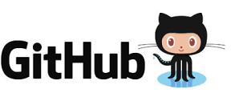

```{r setup, include=FALSE}
library(knitr)
knitr::opts_chunk$set(echo = TRUE)
```

# What is reproducible research?

## Reproducible versus Replicable?

- Replication: does an independent experiment produce results consistant with another?

- Reproduction: can the same result be achieved with the same data and methods?

## Why creating reproducible work is important

<div align="center">

</div>

## Why creating reproducible work is important

<div align="center">

</div>

- www.newyorker.com/news/john-cassidy/the-reinhart-and-rogoff-controversy-a-summing-up

## Why creating reproducible work is important

<div align="center">

</div>

- www.economist.com/node/21528593

## Why creating reproducible work is important

<div align="center">

</div>

# Towards making your research reproducible

## What makes research reproducible

- data availibilty

- code/software available

- documentation to assemble data and code to produce the results

## Some immediate advantages for you

- Easily pick up where you left off even months after you left off

- Easily make adjustments and re-run your analysis

- Full documentation from data collection to publication

- Easily share your work

## Some important practical steps

- Link your analysis to the raw data and document how it was collected
- The original data should remain unmodified
- Avoid any "by hand" steps in your analysis
- Include scripts that take the raw data through to the final results / figure / tables you publish
- Include software versions

# Coding style

## Why is style important

- Style guidelines provide rules for how to format code in a script

- Following style guidelines offers some important advantages:
    + Clean code is easier to read and interpret later.
    + It’s easier to catch and fix mistakes when code is clear.
    + Others can more easily follow and adapt your code if it’s clean.
    + Some style guidelines will help prevent possible problems (e.g.,
avoiding . in function names).

## R style guidelines

Two potential sources:

- [Google's R style guidelines](https://google.github.io/styleguide/Rguide.xml)
- [Hadley Wickham's R style guidelines](http://adv-r.had.co.nz/Style.html)

## Style guideline review

Hear are a few guidelines we've already covered in class:

- Use `<-`, not `=`, for assignment.
- Guidelines for naming objects:
    + All lowercase letters or numbers
    + Use underscore (`_`) to separate words, not camelCase or a dot (`.`) (this differs for Google and Wickhmam style guides)
    + Have some consistent names to use for "throw-away" objects (e.g., `df`, `ex`, `a`, `b`)
- Make names meaningful
    + Descriptive names for R scripts ("random_group_assignment.R")
    + Nouns for objects (`todays_groups` for an object with group assignments)
    + Verbs for functions (`make_groups` for the function to assign groups)

## Line length

Google: **Keep lines to 80 characters or less** \medskip

To set your script pane to be limited to 80 characters, go to "RStudio" -> "Preferences" -> "Code" -> "Display", and set "Margin Column" to 80.

```{r eval = FALSE, echo = TRUE}
# Do
my_df <- data.frame(n = 1:3,
                    letter = c("a", "b", "c"),
                    cap_letter = c("A", "B", "C"))

# Don't
my_df <- data.frame(n = 1:3, letter = c("a", "b", "c"), cap_letter = c("A", "B", "C"))
```

This guideline helps ensure that your code is formatted in a way that you can see all of the code without scrolling horizontally (left and right).

## Spacing

- Binary operators (e.g., `<-`, `+`, `-`) should have a space on either side
- A comma should have a space after it, but not before.
- Colons should not have a space on either side. 
- Put spaces before and after `=` when assigning parameter arguments

```{r eval = FALSE, echo = TRUE}
# Do
shots_per_min <- worldcup$Shots / worldcup$Time
#Don't 
shots_per_min<-worldcup$Shots/worldcup$Time

#Do
ave_time <- mean(worldcup[1:10, "Time"])
#Don't
ave_time<-mean(worldcup[1 : 10 ,"Time"])
```

## Semicolons

Although you can use a semicolon to put two lines of code on the same line, you should avoid it. 

```{r eval = FALSE, echo = TRUE}
# Do
a <- 1:10
b <- 3

# Don't
a <- 1:10; b <- 3
```

## Commenting

- For a comment on its own line, use `#`. Follow with a space, then the comment. 
- You can put a short comment at the end of a line of R code. In this case, put two spaces after the end of the code, one `#`, and one more space before the comment.
- If it helps make it easier to read your code, separate sections using a comment character followed by many hyphens (e.g., `#------------`). Anything after the comment character is "muted". 

```{r eval = FALSE, echo = TRUE}
# Read in health data ---------------------------

# Clean exposure data ---------------------------
```

## Indentation

Google:

- Within function calls, line up new lines with first letter after opening parenthesis for parameters to function calls:

Example:

```{r eval = FALSE, echo = TRUE}
# Relabel sex variable
nepali$sex <- factor(nepali$sex, 
                     levels = c(1, 2),
                     labels = c("Male", "Female"))
```

## Code grouping

- Group related pieces of code together. 
- Separate blocks of code by empty spaces.

```{r eval = TRUE}
# Load data
library(faraway)
data(nepali)

# Relabel sex variable
nepali$sex <- factor(nepali$sex, 
                     levels = c(1, 2),
                     labels = c("Male", "Female"))
```

Note that this grouping often happens naturally when using tidyverse functions, since they encourage piping (`%>%` and `+`).

## Broader guidelines

- Omit needless code.
- Don't repeat yourself.

We'll learn more about satisfying these guidelines when we talk about writing your own functions in the next part of the class.
## Version control

# Code and data sharing

## Choosing your sharing platform
<br>
<div align="center">

</div>
<br>
<div align="center">

</div>
<div align="center">

</div>

# Markup

## What is a markup language?

- In markup languages, you markup the document directly to show what formatting the final version should have (e.g., you type `**bold**` in the file to end up with a document with **bold**).

- Examples include: HTML, LaTex, and Markdown

## For example

<br>
<div align="center">

</div>
<br>

## For example

<br>
<div align="center">

</div>
<br>

# R tools for reproducible research

## RStudio projects

## R Markdown

# Literate programming in R

## Literate programming

**Literate programming**, an idea developed by Donald Knuth, mixes code that can be executed with regular text. \medskip 

```{r echo = FALSE, out.width = "0.9\\textwidth"}
knitr::include_graphics("../figures/KnuthCheck.jpg")
```

\medskip

The files you create can then be rendered, to run any embedded code. The final output will have results from your code and the regular text. 

## Literate programming with `knitr`

The `knitr` package can be used for literate programming in R. \bigskip

```{r echo = FALSE, out.width = "\\textwidth"}
knitr::include_graphics("../figures/RMarkdownWorkflow.png")
```

(Source: RMarkdown Cheatsheet, RStudio) \bigskip

In essence, `knitr` allows you to write an R Markdown file that can be rendered into a pdf, Word, or HTML document.

## Basics

- To open a new RMarkdown file, go to "File" -> "New File" -> "RMarkdown..." -> for now, chose a "Document" in "HTML" format.
- This will open a new R Markdown file in RStudio. The file extension for RMarkdown files is ".Rmd". 
- The new file comes with some example code and text. You can run the file as-is to try out the example. You will ultimately delete this example code and text and replace it with your own.
- Once you "knit" the R Markdown file, R will render an HTML file with the output. This is automatically saved in the same directory where you saved your .Rmd file.
- Write everything besides R code using Markdown syntax.

## Chunk syntax

To include R code in an RMarkdown document, separate off the code chunk using the following syntax:

    `r ''````{r}
    my_vec <- 1:10
    ```

## Naming chunks

You can specify a name for each chunk, if you'd like, by including it after "r" when you begin your chunk. \medskip

For example, to give the name `load_nepali` to a code chunk that loads the `nepali` dataset, specify that name in the start of the code chunk: \bigskip

    `r ''````{r load_nepali}
    library(faraway)
    data(nepali)
    ```

\bigskip 

Some tips: 

- Chunk names must be unique across a document.
- Any chunks you don't name are given numbers by `knitr`.

## Naming chunks

You do not have to name each chunk. However, there are some advantages: 

- It will be easier to find any errors.  
- You can use the chunk labels in referencing for figure labels. 
- You can reference chunks later by name.

## Chunk options

You can add options when you start a chunk. Many of these options can be set as TRUE / FALSE and include:

```{r echo = FALSE}
chunk_opts <- data.frame(Option = c("`echo`",
                                    "`eval`",
                                    "`messages`",
                                    "`warnings`",
                                    "`include`"),
                         Action = c("Print out the R code?",
                                    "Run the R code?",
                                    "Print out messages?",
                                    "Print out warnings?",
                                    "If FALSE, run code, but don't print code or results"))
knitr::kable(chunk_opts)
```

## Chunk options

Other chunk options take values other than TRUE / FALSE. Some you might want to include are:

```{r echo = FALSE}
chunk_opts2 <- data.frame(Option = c("`results`",
                                     "`fig.width`",
                                     "`fig.height`"),
                          Action = c("How to print results (e.g., `hide` runs the code, but doesn't print the results)",
                                     "Width to print your figure, in inches (e.g., `fig.width = 4`)",
                                     "Height to print your figure"))
pander::pander(chunk_opts2, split.cells = c(10, 50),
               justify = c("center", "left"))
```

## Chunk options

Add these options in the opening brackets and separate multiple ones with commas:

```{r  messages = FALSE, echo = FALSE}
    nepali[1, 1:3]
```

\bigskip 

We will go over other options later, once you've gotten the chance to try writting R Markdown files.

## Global options

You can set "global" options at the beginning of the document. This will create new defaults for all of the chunks in the document. \bigskip

For example, if you want `echo`, `warning`, and `message` to be `FALSE` by default in all code chunks, you can run: \bigskip

```{r  global_options}
    knitr::opts_chunk$set(echo = FALSE, message = FALSE,
      warning = FALSE)
```

## Global options

Options that you set specifically for a chunk will take precedence over global options. \bigskip

For example, running a document with:

```{r  global_options}
    knitr::opts_chunk$set(echo = FALSE, message = FALSE,
      warning = FALSE)
```

```{r  check_nepali, echo = TRUE}
    head(nepali, 1)
```

would print the code for the `check_nepali` chunk.

## Inline code

You can also include R output directly in your text ("inline") using backticks: \bigskip

There are `` `r '\x60r nrow(nepali)\x60'` `` observations in the `nepali` data set. The average age is `` `r '\x60r mean(nepali$age, na.rm = TRUE)\x60'` `` months.

\bigskip

Once the file is rendered, this gives: \bigskip

There are `r nrow(nepali)` observations in the `nepali` data set. The average age is `r mean(nepali$age, na.rm = TRUE)` months.

# Working with Rmd files

## R Markdown tips

Here are two tips that will help you diagnose some problems rendering R Markdown files:

- Be sure to save your R Markdown file before you run it.
- All the code in the file will run "from scratch"-- as if you just opened a new R session.
- The code will run using, as a working directory, the directory where you saved the R Markdown file.

## Running code

You'll want to try out pieces of your code as you write an R Markdown document. There are a few ways you can do that:

- You can run code in chunks just like you can run code from a script (Ctrl-Return or the "Run" button). 
- You can run all the code in a chunk (or all the code in all chunks) using the different options under the "Run" button in RStudio. 
- All the "Run" options have keyboard shortcuts, so you can use those.

## Compiling to other formats

You can compile R Markdown documents to other formats:

- Word
- Pdf (requires that you've installed "Tex" on your computer.)
- Slides (ioslides)

\bigskip

Click the button to the right of "Knit" to see different options for rendering on your computer. 

## RPubs

You can freely post your RMarkdown documents at [RPubs](http://rpubs.com). \bigskip

If you want to post to RPubs, you need to create an account. Once you do, you can click the "Publish" button on the window that pops up with your compiled file. \bigskip

RPubs can also be a great place to look for interesting example code, although it sometimes can be pretty overwhelmed with MOOC homework. 

## Find out more

Here are two good how-to books on reproducible research in R (our library has both):

- *Reproducible Research with R and RStudio*, Christopher Gandrud
- *Dynamic Documents with R and knitr*, Yihui Xie

## R Notebooks 

From RStudio's [article on R Notebooks](http://rmarkdown.rstudio.com/r_notebooks.html):

> "An R Notebook is an R Markdown document with chunks that can be executed independently and interactively, with output visible immediately beneath the input."

R Notebooks are a new feature. Right now, if you want to use them, you need to update to RStudio's Preview version. You can get that [here](https://www.rstudio.com/products/rstudio/download/preview/).

You can render an R Notebook document to a final, static version (e.g., pdf, Word, HTML) just like an R Markdown file.  

Therefore, you can use R Notebooks as an alternative to R Markdown, with the ability to try out and change chunks interactively as you write the document. 

You can open a new R Notebook file by going in RStudio to "File" -> "New File". In the Preview version of RStudio, there's an option there for "R Notebook".  

As with R Markdown files, when you choose to create a new R Notebook file, RStudio opens a skeleton file with some example text and formatting already in the file.  

The syntax is very similar to an R Markdown file, but the YAML now specifies: 

```
output: html_notebook
```

## Templates


R Markdown **templates** can be used to change multiple elements of the style of a rendered document. You can think of these as being the document-level analog to the themes we've used with `ggplot` objects.  

To do this, some kind of style file is applied when rendering document. For HTML documents, Cascading Style Sheets (CSS) (`.css`) can be used to change the style of different elements. For pdf files, LaTeX package (style) files (`.sty`) are used. 

To open a new R Markdown file that uses a template, in RStudio, go to "File" -> "New File" -> "R Markdown" -> "From Template". 

Different templates come with different R packages. A couple of templates come with the `rmarkdown` package, which you likely already have. 

Many of these templates will only render to pdf.   

To render a pdf from R Markdown, you need to have a version of TeX installed on your computer. Like R, TeX is open source software. RStudio recommends the following installations by system:

- For Macs: MacTeX
- For PCs: MiKTeX

Links for installing both can be found at http://www.latex-project.org/ftp.html  

Current version of TeX: 3.14159265.

The `tufte` package has templates for creating handouts typeset like Edward Tufte's books.  

This package includes templates for creating both pdf and HTML documents in this style.  

The package includes special functions like `newthought`, special chunk options like `fig.fullwidth`, and special knitr engines like `marginfigure`. Special features available in the tufte template include: 

- Margin references
- Margin figures
- Side notes
- Full width figures

The `rticles` package has templates for several journals: 

- *Journal of Statistical Software* 
- *The R Journal*
- *Association for Computing Machinery*
- ACS publications (*Journal of the American Chemical Society*, *Environmental Science & Technology*) 
- Elsevier publications

Some of these templates create a whole directory, with several files besides the .Rmd file. For example, the template for *The R Journal* includes: 

- The R Markdown file in which you write your article
- "RJournal.sty": A LaTeX package (style) file specific to *The R Journal*. This file tells LaTeX how to render all the elements in your article in the style desired by this journal. 
- "RJreferences.bib": A BibTeX file, where you can save citation information for all references in your article.
- "Rlogo.png": An example figure (the R logo).

Once you render the R Markdown document from this template, you'll end up with some new files in the directory: 

- "[your file name].tex": A TeX file with the content from your R Markdown file. This will be "wrapped" with some additional formatting input to create "RJwrapper.tex".
- "RJwrapper.tex": A TeX file that includes both the content from your R Markdown file and additional formatting input. Typically, you will submit this file (along with the BibTeX, any figure and image files, and possibly the style file) to the journal.
- "RJwrapper.pdf": The rendered pdf file (what the published article would look like)

This template files will often require some syntax that looks more like LaTeX than Markdown.  

For example, for the template for *The R Journal*, you need to use `\citep{}` and `\citet{}` to include citations. These details will depend on the style file of the template.  

As a note, you can always use raw LaTeX in R Markdown documents, not just in documents you're creating with a template. You just need to be careful not to mix the two. For example, if you use a LaTeX environment to begin an itemized list (e.g., with `begin{itemize}`), you must start each item with `item`, not `-`. 

You can create your own template. You create it as part of a custom R package, and then will have access to the template once you've installed the package. This can be useful if you often write documents in a certain style, or if you ever work somewhere with certain formatting requirements for reports.  

RStudio has full instructions for creating your own template: http://rmarkdown.rstudio.com/developer_document_templates.html

## R Projects

### Organization

So far, you have run much of your analysis within a single R script or R Markdown file. Often, any associated data are within the same working directory as your script or R Markdown file, but the files for one project are not separated from files for other projects.  

As you move to larger projects, this kind of set-up won't work as well. Instead, you'll want to start keeping all materials for a project in a single and exclusive directory.

Often, it helps to organize the files in a project directory into subdirectories. Common subdirectories include: 

- `data-raw`: Raw data and R scripts to clean the raw data. 
- `data`: Cleaned data, often saved as `.RData` after being generated by a script in `data-raw`.
- `R`: Code for any functions used in analysis.
- `reports`: Any final products rendered from R Markdown and their original R Markdown files (e.g., paper drafts, reports, presentations).

### Creating R Projects

RStudio allows you to create "Projects" to organize code, data, and results within a directory. When you create a project, RStudio adds a file with the extension ".Rproj" to the directory.  

There are some advantages to setting a directory to be an R Project. The project:

- Automatically uses the directory as your current working directory when you open the project. 
- Coordinates well with git version control and GitHub repository system. 
- Opens a "Files" window for navigating project files in an RStudio pane when you open the project. 

You can create a new project from scratch or from an existing directory.  

To create an R project from a working directory, in RStudio go to "File" -> "New Project" -> "New Directory". You can then choose where you want to save the new project directory.

## git

Git is a version control system. 

It saves information about all changes you make on all files in a repository. This allows you to revert back to previous versions and search through the history for all files in the repository. 

Git is open source. You can download it for different operating systems here: 

https://git-scm.com/downloads

You will need git on your computer to use git with RStudio and create local git repositories you can sync with GitHub repositories.


Before you use git, you should configure it. For example, you should make sure it has your name and email address. 

You can configure git with commands at the shell. For example, I would run the following code at a shell to configure git to have my proper user name and email:  

```
git config --global user.name "Nick Good"
git config --global user.email "n.good@colostate.edu"
```


Sometimes, RStudio will automatically find git (once you've installed git) when you start RStudio. 

However, in some cases, you may need to take some more steps to activate git in RStudio. To do this, go to "RStudio" -> "Preferences" -> "Git/SVN". Choose "Enable version control". If RStudio doesn't find your version of git in the "Git executable" box, browse for it. 

### Initializing a git repository

You can initialize a git repository using commands from the shell. To do that, take the following steps (first check that it is not already a git repository):

1. Use a shell ("Terminal" on Macs) to navigate to to that directory. You can use `cd` to do that (similar to `setwd` in R). 
2. Once you are in the directory, run `git status`. If you get the message `fatal: Not a git repository (or any of the parent directories): .git`, it is not yet a git repository. 
3. If you do not get an error from `git status`, the directory is already a repository. If you do get an error, run `git init` to initialize it as a repository.

For example, if I wanted to make the "fars_analysis" directory, which is a direct subdirectory of my home directory, a git repository, I could open a shell and run: 

```
cd ~/fars_analysis
git init
```

You can also initialize a git repository for a directory that is an R Project directory through R Studio. 

1. Open the Project. 
2. Go to "Tools" -> "Version Control" -> "Project Setup".
3. In the box for "Version control system", choose "Git".

**Note:** If you have just installed git, and have not restarted RStudio, you'll need to do that before RStudio will recognize git. If you do not see "Git" in the box for "Version control system", it means either that you do not have git installed on your computer or that RStudio was unable to find it.

Once you initialize the project as a git repository, you should have a "Git" window in one of your RStudio panes (top right pane by default). 

As you make and save changes to files, they will show up in this window for you to commit. For example, this is what the Git window for our coursebook looks like when I have changes to the slides for week 9 that I need to commit: 

```{r echo = FALSE, out.width="0.8\\textwidth", fig.align="center"}
knitr::include_graphics("_book/figures/ExampleGitWindow.png")
```

### Committing

When you want git to record changes, you *commit* the files with the changes. Each time you commit, you have to include a short commit message with some information about the changes. 

You can make commits from a shell. However, in this course we'll just make commits from the RStudio environment. 


To make a commit from RStudio, click on the "Commit" button in the Git window. That will open a separate commit window that looks like this: 

```{r echo = FALSE, out.width="0.8\\textwidth", fig.align="center"}
knitr::include_graphics("_book/figures/ExampleCommitWindow.png")
```


In this window, to commit changes: 

1. Click on the files you want to commit to select them. 
2. If you'd like, you can use the bottom part of the window to look through the changes you are committing in each file. 
3. Write a message in the "Commit message" box. Keep the message to one line in this box if you can. If you need to explain more, write a short one-line message, skip a line, and then write a longer explanation. 
4. Click on the "Commit" button on the right. 

Once you commit changes to files, they will disappear from the Git window until you make and save more changes in them.

### Browsing history 

On the top left of the Commit window, you can toggle to "History". This window allows you to explore the history of commits for the repository.

```{r echo = FALSE, out.width="0.8\\textwidth", fig.align="center"}
knitr::include_graphics("_book/figures/ExampleHistoryWindow.png")
```

GitHub allows you to host git repositories online. This allows you to: 

- Work collaboratively on a shared repository
- Fork someone else's repository to create your own copy that you can use and change as you want
- Suggest changes to other people's repositories through pull requests


To push local repositories to GitHub and fork other people's repositories, you will need a GitHub account. 

You can sign up at https://github.com. A free account is fine. 


The basic unit for working in GitHub is the repository. You can think of a repository as very similar to an R Project--- it's a directory of files with some supplemental files saving some additional information about the directory. 

While R Projects have this additional information saved as an ".RProj" file, git repositories have this information in a directory called ".git". Because this pathname starts with a dot, it won't show up in many of the ways you list files in a directory. From a shell, you can see files that start with `.` by running `ls -a` from within that directory. 


### Linking local repo to GitHub repo

If you have a local directory that you would like to push to GitHub, these are the steps to do it. 

First, you need to make sure that the directory is under git version control. See the notes on initializing a repository.

Next, you need to create an empty repository on GitHub to sync with your local repository. Do that by: 

1. In GitHub, click on the "+" in the upper right corner ("Create new").
2. Choose "Create new repository".
3. Give your repository the same name as the local directory you'd like to connect it to. For example, if you want to connect it to a directory called "fars_analysis" on your computer, name the repository "fars_analysis".
4. Leave everything else as-is (unless you'd like to add a short description in the "Description" box). Click on "Create repository" at the bottom of the page.


Now you are ready to connect the two repositories. 

First, you'll want to change some settings in RStudio so GitHub will recognize that your local repository belongs to you, rather than asking for you password every time. 

- In RStudio, go to "RStudio" -> "Preferences" -> "Git / svn". Choose to "Create RSA key".
- Click on "View public key". Copy what shows up.
- Go to your GitHub account and navigate to "Settings". Click on "SSH and GPG keys". 
- Click on "New SSH key". Name the key something like "RStudio" (you might want to include the device name if you'll have SSH keys from RStudio on several computers). Past in your public key in the "Key box".

### Syncing RStudio and GitHub

Now you're ready to push your local repository to the empty GitHub repository you created. 

1. Open a shell and navigate to the directory you want to push. (You can open a shell from RStudio using the gear button in the Git window.)
2. Add the GitHub repository as a remote branch with the following command (this gives an example for adding a GitHub repository named "ex_repo" in my GitHub account, "geanders"):
```
git remote add origin git@github.com:geanders/ex_repo.git
```

3. Push the contents of the local repository to the GitHub repository.
```
git push -u origin master
```

To pull a repository that already exists on GitHub and to which you have access (or that you've forked), first use `cd` to change a shell into the directory where you want to put the repository then run `git clone` to clone the repository locally. For example, if I wanted to clone a GitHub repository called "ex_repo" in my GitHub account, I would run:

```
git clone git@github.com:geanders/ex_repo.git
```

Once you have linked a local R project with a GitHub repository, you can push and pull commits using the blue down arrow (pull from GitHub) and green up arrow (push to GitHub) in the Git window in RStudio. 

```{r echo = FALSE, out.width="0.8\\textwidth", fig.align="center"}
knitr::include_graphics("_book/figures/ExampleGitWindow.png")
```


GitHub helps you work with others on code. There are two main ways you can do this: 

- **Collaborating:** Different people have the ability to push and pull directly to and from the same repository. When one person pushes a change to the repository, other collaborators can immediately get the changes by pulling the latest GitHub commits to their local repository. 
- **Forking:** Different people have their own GitHub repositories, with each linked to their own local repository. When a person pushes changes to GitHub, it only makes changes to his own repository. The person must issue a pull request to another person's fork of the repository to share the changes. 

### Issues 

Each original GitHub repository (i.e., not a fork of another repository) has a tab for "Issues". This page works like a Discussion Forum.  

You can create new "Issue" threads to describe and discuss things that you want to change about the repository. 

Issues can be closed once the problem has been resolved. You can close issues on the "Issue" page with the "Close issue" button. 

If a commit you make in RStudio closes an issue, you can automatically close the issue on GitHub by including "Close #[issue number]" in your commit message and then pushing to GitHub. 

For example, if issue #5 is "Fix typo in section 3", and you make a change to fix that typo, you could make and save the change locally, commit that change with the commit message "Close #5", and then push to GitHub, and issue #5 in "Issues" for that GitHub repository will automatically be closed, with a link to the commit that fixed the issue. 

### Pull request

You can use a *pull request* to suggest changes to a repository that you do not own or otherwise have the permission to directly change. 

You can also use pull requests within your own repositories. Some people will create a pull request every time they have a big issue they want to fix in one of their repositories. 

In GitHub, each repository has a "Pull requests" tab where you can manage pull requests (submit a pull request to another fork or merge in someone else's pull request for your fork).

Take the following steps to suggest changes to someone else's repository: 

1. Fork the repository
2. Make changes (locally or on GitHub)
3. Save your changes and commit them
4. Submit a pull request to the original repository
5. If there are not any conflicts and the owner of the original repository likes your changes, he or she can merge them directly into the original repository. If there are conflicts, these need to be resolved before the pull request can be merged. 

### Merge conflicts

At some point, you will get *merge conflicts*. These happen when two people have changed the same piece of code in two different ways at the same time. 

For example, say Rachel and are both working on local versions of the same repository, and I change a line to `mtcars[1, ]` while Rachel changes the same line to `head(mtcars, 1)`. Rachel pushes to the GitHub version of the repository before I do.  

When I pull the latest commits to the GitHub repository, I will have a merge conflict for this line. To be able to commit a final version, I'll need to decide which version of the code to use and commit a version of the file with that code. 

Merge conflicts can come up in a few situations: 

- You pull in commits from the GitHub branch of a repository you've been working on locally.
- Someone sends a pull request for one of your repositories.

If there are merge conflicts, they'll show up like this in the file: 

```
<<<<<<< HEAD
mtcars[1, ]
=======
head(mtcars, 1)
>>>>>>> remote-branch
```

To fix them, search for all these spots in files with conflicts, pick the code you want to use, and delete everything else. 

For the example conflict, I might change the file from this:

```
<<<<<<< HEAD
mtcars[1, ]
=======
head(mtcars, 1)
>>>>>>> remote-branch
```

To this: 

```
head(mtcars, 1)
```

Then you can save and commit the file.

### Find out more

If you'd like to find out more, Hadley Wickham has a great chapter on using git and GitHub with RStudio in his *R Packages* book:

http://r-pkgs.had.co.nz/git.html


## In-course exercise

### Trying out templates 

- Open a "Tufte" template document. To open a new document from a template, in RStudio go to "File" -> "New File" -> "R Markdown" -> "From Template". If "Tufte Handout" does not show up as a choice, install and load the `tufte` package, restart R, and try again. 
- Render the document to an HTML and open it in a browser. Explore the rendered document. What elements does it include that are not typical for R Markdown documents?
- Now go and look at the .Rmd file. Find the spots where these new elements are specified in the R Markdown file. How are elements like margin plots and all caps at the starts of some paragraphs included in the document?
- Download and install the `rticles` package. Create a new document using the template for *The R Journal*. When you do that, a whole directory will be copied to your current working directory. Check out the files in that directory. If you have a version of TeX installed on your computer, try compiling the example file. 
- Select three or four key journals in your field. Go to the journal's website and see if you can figure out: 
    + Do they allow authors to submit ".tex" files?
    + If so, do they provide a LaTeX style file for their journal?

### Organizing a project

In this part of the group exercise, you will set up an R Project to use for the next homework assignment. You will want to set up a similar project for your group project. 

- First, you need to create a new project. In RStudio, go to "File" -> "New Project" -> "New Directory". Choose where you want to save this directory and what you want to name it. 
- If the R Project does not automatically open once you make it, navigate to the ".Rproj" file created for the project and double-click on that. Alternatively, you can go to "File" -> "Open Project". 
- Use `getwd` once you've opened your project to determine which working directory is automatically used for the project. 
- Once you open the project, one of the RStudio panes should have a tab called "Files". This shows the files in this project directory and allows you to navigate through them. Currently, you won't have any files other than the R project file (".Rproj"). As a next step, create several subdirectories. We'll use these to structure the code, data, and R Markdown files for your homework. Create the following subdirectories (you can use the "New Folder" button in the RStudio "Files" pane): 
    + `data-raw`
    + `data`
    + `R`
    + `writing`
- The `data-raw` directory will ultimately have your raw data as well as some R scripts with code for cleaning up the raw data. The homework requires you to pull FARS data from several years. Create a subdirectory in `data-raw` that will just have that data. In the "Files" pane in RStudio, navigate into the `data-raw` subdirectory. Use the "New Folder" button to create a new subdirectory within the `data-raw` subdirectory. Name it `yearly_person_data`. 
- Download FARS data from the years 1999 to 2010. From each year, pull out the "person" file. Save these yearly "person" files in the `yearly_person_data` subdirectory you created. As a file name, use "person_" and then the year. For example, if you are saving this file for 1999 in the form of a csv, you would name the file "person_1999.csv".
- The `writing` subdirectory will have your R Markdown file and its output. Create a new R Markdown file ("File" -> "New File" -> "R Markdown") and save it to this subdirectory. You can change the name and date for the file if you'd like. Delete all the text that comes as a default. Write a piece of code that lists the files you saved in `data-raw/yearly_person_data`. Remember that the working directory for an R Markdown file is the directory in which it's saved, so you'll need to use a relative pathname that goes up one directory (`..`) and then goes into `data-raw` and `yearly_person_data`. 
- If you have time, go to the FARS documentation that you found in an earlier in-course exercise and find out more about which variables are included in this data set and which values they can have. 

### Initializing git for an R Project

- If you do not already have one, sign up for a GitHub account. The free option is fine. 
- If you do not already have git installed on your computer, install it: https://git-scm.com/downloads
- Open a shell and configure git. For example, I would open a shell and run: 
```
git config --global user.name "Brooke Anderson"
git config --global user.email "brooke.anderson@colostate.edu"
```
- Restart RStudio. go to “RStudio” -> “Preferences” ->“Git/SVN”. Choose “Enable version control”. If RStudio doesn’t find yourversion of git in the “Git executable” box, browse for it.
- Open your FARS analysis project in RStudio. Change your Project settings to initialize git for this project (see the course notes for tips on how to do that).
- Try changing a few things in files you have in that project directory (or add a new file). Commit those changes using the "Commit" window. After you commit the changes, look at the "History" window to see the history of your commits.

### Linking your project with a GitHub repository

- Create an empty GitHub repository for the project. Give it the same name as the name of your R project directory. 
- Create an RSA key in RStudio and add it as an SSH key in your GitHub settings.
- Add this empty GitHub repository as the remote branch of your local git repository for the project. 
- Push your local repository to this GitHub repository. 
- Go to your GitHub account and make sure the repository was pushed. 
- Try making some more changes to your local repository. Commit the changes, then use the green up arrow in the Git window to push the changes to your GitHub repository.

## Git / GitHub integration

# Applications: Exploratory data analysis

# Applications: Presentations


